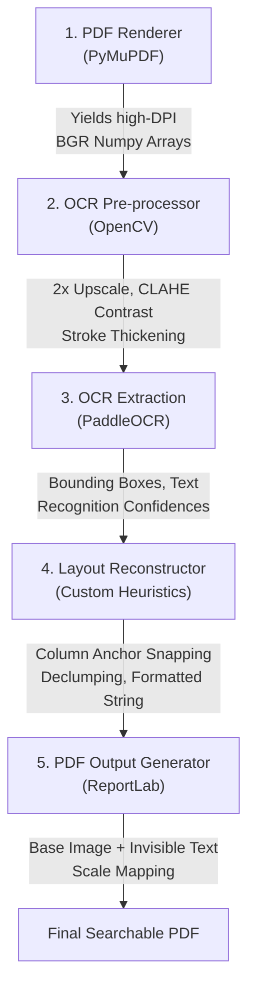

# OCR Pipeline: Progress & Optimizations Report

**Date:** April 2, 2026
**Project:** General OCR Pipeline Restructuring
**Status:** Architecture Refined; Preparing for LLM Post-Processing Integration (Qwen-VL-4B)

---

## 1. Executive Summary
This report outlines the recent optimizations and architectural improvements applied to the OCR Pipeline. The primary focus has been on stabilizing the [PaddleOCR](file:///c:/projects/test/pipeline/ocr_engine.py#13-55) integration, stripping out legacy technical debt, ensuring pipeline reliability, and establishing a robust foundation for the impending Qwen-VL-4B post-processing layer.

---

## 2. Completed Milestones

### 2.1 Dependency Resolution & System Stabilization
- **Identified Blocker:** The pipeline was failing to initialize due to a `TypeError` rooted in a protobuf/PaddleOCR library conflict.
- **Resolution:** Successfully forced a downgrade of the `protobuf` package (`<=3.20.3`) in the virtual environment constraints, restoring full PaddleOCR functionality and allowing local test sequences to complete successfully.

### 2.2 Pipeline Optimization & Technical Debt Removal
To streamline the execution path and enforce consistency, we aggressively removed outdated components:
- **Deprecated RapidOCR:** Completely stripped the `RapidOCREngine` class from [pipeline/ocr_engine.py](file:///c:/projects/test/pipeline/ocr_engine.py), establishing [PaddleOCR](file:///c:/projects/test/pipeline/ocr_engine.py#13-55) as the single source of truth for text extraction.
- **Removed Unused Modules:** Removed the unused `deskew` logic from the [clean_image()](file:///c:/projects/test/preprocessing/cleaner.py#32-58) preprocessing block.
- **CLI Simplification:** Cleaned up [run.py](file:///c:/projects/test/run.py) and [evaluate_performance.py](file:///c:/projects/test/evaluate_performance.py) by removing redundant arguments (`--engine`, `--no-deskew`), significantly reducing code complexity.

### 2.3 Bug Fixes & Refactoring
- **Fixed [reconstruct_layout](file:///c:/projects/test/pipeline/layout_reconstructor.py#102-199) API Crash:** Addressed an execution failure where [pipeline/extractor.py](file:///c:/projects/test/pipeline/extractor.py) was passing an unexpected `dpi` argument into the localized layout reconstructor algorithm. 
- **End-to-End Validation:** Successfully executed the pipeline across multi-page invoice inputs ([batch2.pdf](file:///c:/projects/test/samples/batch2.pdf)), validating that the optimized codebase correctly generates fully searchable PDF overlays and reconstructed layout [.txt](file:///c:/projects/test/requirements.txt) files without engine crashes.

---

## 3. Technical Pipeline Definition

The pipeline fundamentally transforms unsearchable scanned documents into structured layout strings and layered searchable PDFs through a deterministic, 5-stage continuous flow:

### Stage Breakdown
1. **Rendering ([pipeline/pdf_renderer.py](file:///c:/projects/test/pipeline/pdf_renderer.py)):** Converts the input digital PDF structure into rasterized image pages at an idealized 300 DPI (to maintain resolution integrity for dense text).
2. **Preprocessing Analytics ([preprocessing/cleaner.py](file:///c:/projects/test/preprocessing/cleaner.py)):** Forces a 2x spatial upscale across the raster. It executes advanced CV morphological operations (erosion for stroke thickening) paired with CLAHE enhancement to deliberately rescue faint or severely degraded characters typical in scans.
3. **Extraction Engine ([pipeline/ocr_engine.py](file:///c:/projects/test/pipeline/ocr_engine.py)):** Employs PaddleOCR acting exclusively as a visual parser (`use_angle_cls=True`) to extrapolate spatial boundaries. Absolute noise (contours less than 10px tall) and positional jitter are instantly discarded via rounded filtering heuristics.
4. **Layout Reconstruction Orchestrator ([pipeline/layout_reconstructor.py](file:///c:/projects/test/pipeline/layout_reconstructor.py)):** The primary layout stabilization engine. It groups text chunks vertically within a 60% relative line height tolerance. It calculates native page gutters via a localized clustering algorithm, dynamically snapping text arrays across X-columns natively mapping identical indentation to the output text. A discrete [_de_clump](file:///c:/projects/test/pipeline/layout_reconstructor.py#17-68) and [_de_fragment](file:///c:/projects/test/pipeline/layout_reconstructor.py#70-100) layer patches simple OCR spacing failure signatures (e.g. stitching broken email usernames back together).
5. **Searchable Generator ([pipeline/pdf_writer.py](file:///c:/projects/test/pipeline/pdf_writer.py)):** Uses ReportLab's exact bounding-box text placement feature, forcing invisible (`3 Tr`) font placements directly over their raster counterparts. The fonts are algorithmically width-scaled dynamically to prevent visual offset during user selection/Ctrl+F events.

---

## 4. Evaluation Metrics & Current Baseline

The pipeline features a native benchmarking harness ([evaluate_performance.py](file:///c:/projects/test/evaluate_performance.py)) evaluating performance via 5 critical lenses. We ran our latest testing suite on the primary test dataset. Here are the target thresholds compared against our **actual current metrics**:

| Category | Metric | Evaluation Tool | Target Threshold | Actual Achieved | Status |
|----------|--------|-----------------|------------------|-----------------|--------|
| **System Profiling** | Latency / RAM Peak | `tracemalloc` + [time](file:///c:/projects/test/evaluate_performance.py#187-211) | Low overhead | ~0.60s latency, ~8 MB | ✅ Pass |
| **Integrity** | Word Error Rate (WER) | `jiwer` | **≤ 5.0%** against baseline | **~20.00%** | ❌ Fail (Needs LLM) |
| **Integrity** | Character Error Rate (CER) | `jiwer` | **≤ 2.0%** deviation | **~11.00%** | ❌ Fail (Needs LLM) |
| **Spatial Consistency** | Line Count Δ | Custom structural diff | **≤ 5 lines** drift | **-4 lines** drift | ✅ Pass |
| **Algorithmic Layout** | Multi-column Preservation | Column gutter detection | **≥ 10.0%** multi-column | **92.1%** | ✅ Pass |
| **Lexical Formatting** | Word Non-Clumping % | `wordninja` NLP validation | **≥ 95.0%** | **99.3%** | ✅ Pass |

*Conclusion:* The native heuristics have perfectly stabilized the **layout constraints** (columns, rows, spacing, zero clumping). However, PaddleOCR's raw **text integrity** (WER/CER) fails the strict financial threshold. This perfectly validates the requirement for our Qwen-VL post-processing correction pass.

---

## 5. Next Steps: Qwen-VL-4B Integration

With the deterministic OCR pipeline stabilized, development is moving to the integration phase.

* **Objective:** Introduce an LLM Auto-Correction Layer strictly acting as a post-processor to eliminate OCR-induced hallucinations, misspellings, and fragmented parsing (e.g., misreading currency glyphs).
* **Tooling:** Awaiting the successful local instantiation of the **Qwen-VL-4B** model.
* **Implementation Plan:**
  1. Construct a privacy-first local wrapper mapping the Qwen-VL-4B inferences.
  2. Implement strict zero-temperature constraints and deterministic prompt engineering logic.
  3. Integrate the Word Error Rate (WER) failsafe guardrail to revert any aggressive LLM rewrites back to raw OCR text if deviation thresholds (>10%) are exceeded.
